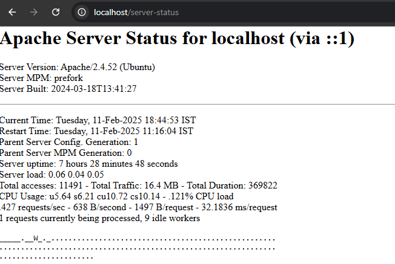

# 🛠️ Penetration Testing Notes  

## 🔍 Hidden Page Discovery  

### **Target Website:**  
- **URL:** `http://localhost/DVWA/login.php`  
- Conducted **active scanning** using **OWASP ZAP**, which led to the discovery of a hidden page.  

### **Discovered Hidden Page:**  
- **URL:** `http://localhost/server-status`  
- **Purpose:** Displays real-time Apache server status, including active requests, CPU usage, server uptime, and connection details.  

---

## 🔎 **Findings from Server-Status Page**  

### **1️⃣ Apache Version & Configuration Details**  
- **Server Version:** Apache/2.4.52 (Ubuntu)  
- **MPM Type:** prefork  
- **Server Built Date:** 2024-03-18  
- **Current Server Time:**  [2025-02-11 11:45:39 GMT]  
- **Uptime:** 33 minutes 56 seconds  

## HIDDEN PAGE 
Below is the screenshot of the HIDDEN PAGE in the Website.


### **2️⃣ Performance Metrics & Resource Utilization**  
| Metric          | Value |
|----------------|-------|
| **Server Load** | 0.01 0.02 0.06 |
| **Total Accesses** | 11,346 |
| **Total Traffic** | 16.2 MB |
| **Requests Per Second** | 5.57 |
| **Data Transfer Rate** | 8.1 kB/sec |
| **Avg. Request Processing Time** | 7.12692 ms |

### **3️⃣ Active Requests & Idle Workers**  
- **Current Active Requests:** `1`  
- **Idle Workers:** `9`  

### **4️⃣ Connection Breakdown**  
| PID | Request Type | Client IP | Target Page | Protocol |
|-----|-------------|-----------|-------------|----------|
| 3479 | GET | 127.0.0.1 | `/DVWA/login.php` | HTTP/1.1 |
| 1730 | POST | 127.0.0.1 | `/DVWA/login.php` | HTTP/1.1 |
| 1731 | GET | 127.0.0.1 | `/DVWA/dvwa/css/` | HTTP/1.1 |
| 1732 | TRACK | 127.0.0.1 | `/DVWA/login.php4S0RA` | HTTP/1.1 |
| 3100 | GET | ::1 | `/server-status` | HTTP/1.1 |

---

## 🛑 **Security Implications**  

### 🔥 **Potential Risks:**  
1. **Information Disclosure**  
   - The `/server-status` page exposes **real-time server metrics**, making it an **attractive target for attackers**.  
   - The page reveals **active client IPs, request types, and accessed resources**, which could aid in **reconnaissance attacks**.  

2. **Unauthenticated Access**  
   - The page is **accessible without authentication**, allowing an attacker to **passively monitor server activity**.  

3. **Sensitive Data Exposure**  
   - Reveals **Apache version, MPM configuration, and uptime**, which can be used to identify **known vulnerabilities** in outdated versions.  

4. **TRACK Method Detected**  
   - **Vulnerability:** The `TRACK` method is **enabled**, which could indicate **potential HTTP TRACE/TRACK vulnerability (CVE-2003-1567)**.  

---

## 🛠️ **Recommended Fixes**  

## 🛠️ **Recommended Fixes**  

### ✅ **1. Restrict Access to Server-Status Page**  
Modify the **Apache configuration file (`/etc/apache2/sites-available/000-default.conf`)** to limit access:  

```apache
<Location /server-status>
    SetHandler server-status
    Require ip 127.0.0.1
</Location>
```

🔹 Only localhost will be able to access the page.

---

### ✅ **2. Disable TRACK & TRACE Methods**  
Edit the Apache configuration file (`/etc/apache2/apache2.conf`) and add:

```apache
TraceEnable off
```

🔹 Prevents potential XST (Cross-Site Tracing) attacks.

---

### ✅ **3. Hide Apache Version & Server Details**  
Edit security.conf (`/etc/apache2/conf-available/security.conf`) and update:

```apache
ServerTokens Prod
ServerSignature Off
```

🔹 Prevents version disclosure in error pages and HTTP responses.

