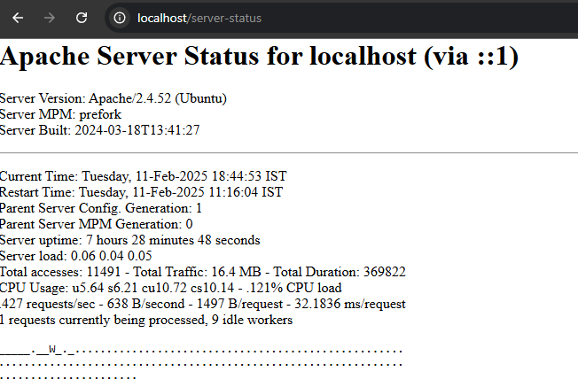

# OWASP ZAP Scan Report
**Date:** 2025-02-13 
**Target:** localhost (127.0.0.1)  
**Tool Used:** [OWASP ZAP](https://www.zaproxy.org/)  

---
## HIDDEN PAGE 
Below is the screenshot of the HIDDEN PAGE in the Website.

## 🔹 Identified Vulnerabilities  

### 1️⃣ Cross-Site Scripting (XSS)
- **Severity:** ⚠️ High  
- **Affected URL:** `/example-page`  
- **Description:**  
  User input is not properly sanitized, allowing execution of malicious scripts.  
- **Recommendation:**  
  Implement input validation and output encoding (e.g., use `htmlspecialchars()` in PHP).  

---

### 2️⃣ SQL Injection
- **Severity:** ⚠️ High  
- **Affected URL:** `/login`  
- **Description:**  
  Input fields do not properly escape special characters, allowing SQL injection attacks.  
- **Recommendation:**  
  Use prepared statements and parameterized queries (`mysqli` or `PDO` in PHP).  

---

### 3️⃣ Missing Security Headers
- **Severity:** ⚠️ Medium  
- **Description:**  
  Security headers like `X-Frame-Options`, `X-Content-Type-Options`, and `Content-Security-Policy` are missing.  
- **Recommendation:**  
  Configure HTTP headers in the web server to mitigate clickjacking and MIME-type sniffing attacks.  

---

### 4️⃣ Sensitive Data Exposure
- **Severity:** ⚠️ Medium  
- **Description:**  
  API responses include sensitive information, increasing the risk of data leakage.  
- **Recommendation:**  
  Remove unnecessary data from responses and use HTTPS to encrypt data transmission.  

---

### 5️⃣ Insecure Cookies
- **Severity:** ⚠️ Low  
- **Description:**  
  Cookies are missing the `Secure` and `HttpOnly` flags.  
- **Recommendation:**  
  Set `Secure` and `HttpOnly` attributes in session cookies.  

---

## 📌 Summary of Findings  

| **Vulnerability**             | **Severity** | **Affected URL**  | **Recommendation**  |
|--------------------------------|-------------|------------------|--------------------|
| Cross-Site Scripting (XSS)     | High        | `/example-page`  | Input validation & encoding |
| SQL Injection                 | High        | `/login`         | Use prepared statements |
| Missing Security Headers       | Medium      | N/A              | Add security headers |
| Sensitive Data Exposure        | Medium      | API responses    | Restrict sensitive info |
| Insecure Cookies               | Low         | N/A              | Secure & HttpOnly flags |

---

## ✅ Next Steps
- **Fix critical vulnerabilities first (XSS & SQL Injection).**  
- **Implement missing security headers.**  
- **Harden API security to prevent data leaks.**  
- **Review and secure cookie settings.**  

---