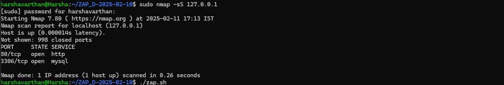
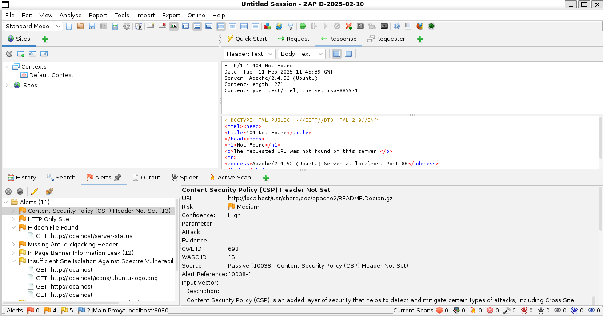
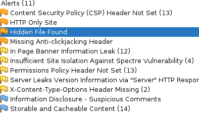

# Vulnerability Assessment Report

## Project: Sample Web Application Security Audit
**Tested Application:** DVWA - Damn Vulnerable Web Application  
**Tested URL:** [http://localhost/DVWA/login.php](http://localhost/DVWA/login.php)  
**Tools Used:** OWASP ZAP, Burp Suite, Nmap  
**Tester:** Harshavarthan N  
**Date:**  2025-02-13  

---

## 1. Overview
The objective of this assessment was to identify security vulnerabilities present in the DVWA application running on a local server and provide recommendations to mitigate these issues.  
The assessment involved:
- Scanning open ports using Nmap.
- Identifying security vulnerabilities using OWASP ZAP.
- Performing a basic penetration test using Burp Suite.

---

## 2. Nmap Scan Results
An Nmap scan was conducted to find open ports and services running on the target system.

### Command Used:
```sh
nmap -sV -p- localhost

## Nmap Scan Results
Below is a screenshot of the Nmap scan showing the open ports:


```

### Findings:
| Port  | Service  | Version |
|-------|---------|---------|
| 22    | SSH     | OpenSSH 8.2p1 Ubuntu |
| 80    | HTTP    | Apache 2.4.52 Ubuntu |
| 3306  | MySQL   | MySQL Database Server |

### Risks & Recommendations:
- **Port 22 (SSH):** Ensure strong passwords or use key-based authentication.
- **Port 80 (HTTP):** Enforce HTTPS with an SSL certificate.
- **Port 3306 (MySQL):** Restrict remote database access.

---

## 3. OWASP ZAP Vulnerabilities Identified
A security scan with OWASP ZAP identified **11 security alerts**, categorized based on risk severity.

## OWASP ZAP Alerts
This screenshot shows the OWASP ZAP Analysis:


## OWASP ZAP Alerts
This screenshot shows the OWASP ZAP alerts:



### Summary of Alerts:
| Alert ID | Vulnerability | Risk Level |
|----------|--------------|------------|
| 1 | Missing Content Security Policy (CSP) | ⚠ High |
| 2 | Website Uses HTTP Instead of HTTPS | ⚠ High |
| 3 | Sensitive File Accessible (/server-status) | ⚠ High |
| 4 | Missing Clickjacking Protection | ⚠ High |
| 5 | Server Version Disclosure | ⚠ Medium |
| 6 | Missing Cross-Origin-Resource-Policy Header | ⚠ Medium |
| 7 | Missing Permissions Policy Header | ⚠ Medium |
| 8 | Web Server Header Leaks Version Information | ⚠ Medium |
| 9 | Missing MIME-Sniffing Protection | ⚠ Medium |
| 10 | Suspicious Comments in Source Code | ⚠ Low |
| 11 | Sensitive Data Caching in Browser | ⚠ Low |

---

## 4. Detailed Findings & Recommendations

### 1. Missing Content Security Policy (CSP)
**Issue:** The application lacks a CSP header, making it vulnerable to Cross-Site Scripting (XSS) attacks.  
**Mitigation:** Add the following CSP policy in the Apache/Nginx server:
```sh
Header set Content-Security-Policy "default-src 'self'; script-src 'self';"
```

### 2. Website Uses HTTP Instead of HTTPS
**Issue:** HTTP connections are insecure, making the website vulnerable to Man-in-the-Middle attacks.  
**Mitigation:** Install an SSL certificate using Let’s Encrypt:
```sh
sudo apt install certbot python3-certbot-apache
sudo certbot --apache
```
Redirect all HTTP requests to HTTPS.

### 3. Sensitive File Accessible (/server-status)
**Issue:** The /server-status page exposes critical Apache server information.  
**Mitigation:** Disable public access to /server-status:
```sh
<Location /server-status>
    SetHandler server-status
    Require local
</Location>
```

### 4. Missing Clickjacking Protection
**Issue:** The application is vulnerable to clickjacking attacks.  
**Mitigation:** Add X-Frame-Options to deny iframe embedding:
```sh
Header always set X-Frame-Options "DENY"
```

### 5. Server Version Disclosure
**Issue:** Apache discloses its version, making it easier for attackers to find exploits.  
**Mitigation:** Hide version details in Apache:
```sh
ServerTokens Prod
ServerSignature Off
```

### 6. Missing Cross-Origin-Resource-Policy (CORP)
**Issue:** The website lacks the Cross-Origin-Resource-Policy (CORP) header.  
**Mitigation:** Add CORP policy:
```sh
Header always set Cross-Origin-Resource-Policy "same-origin"
```

### 7. Missing Permissions Policy Header
**Issue:** The application does not restrict browser permissions.  
**Mitigation:** Add a Permissions Policy:
```sh
Header always set Permissions-Policy "geolocation=(), microphone=()"
```

### 8. Web Server Header Leaks Version Information
**Issue:** The Server header exposes web server version details.  
**Mitigation:** Hide the server tokens:
```sh
ServerTokens Prod
ServerSignature Off
```

### 9. Missing MIME-Sniffing Protection
**Issue:** MIME-sniffing can allow attackers to execute disguised files.  
**Mitigation:** Add the X-Content-Type-Options header:
```sh
Header always set X-Content-Type-Options "nosniff"
```

### 10. Suspicious Comments in Source Code
**Issue:** Hidden comments in the HTML contain sensitive information.  
**Mitigation:** Remove all sensitive comments from HTML, JavaScript, and PHP files.

### 11. Sensitive Data Caching in Browser
**Issue:** Sensitive pages are cached, increasing the risk of session hijacking.  
**Mitigation:** Add cache-control headers:
```sh
Header always set Cache-Control "no-store, no-cache, must-revalidate, max-age=0"
```

---

## 5. Basic Penetration Testing
### Finding: Exposed /server-status Page
- The `/server-status` page was accessible without authentication.
- This page displayed real-time Apache server status, including version, uptime, active connections, and resource usage.

### Exploit Attempt:
Navigating to `http://localhost/server-status` revealed server information, which an attacker could use to target vulnerabilities.

### Mitigation:
Disable public access to `/server-status` in Apache settings as recommended earlier.

---

## 6. Conclusion
This assessment identified **critical vulnerabilities** that need **immediate attention**.  
Implementing the recommended security measures will reduce the attack surface and protect sensitive data.

### **Key Actions Required:**
✅ Enforce HTTPS  
✅ Restrict access to `/server-status`  
✅ Apply security headers  
✅ Hide server version information  
✅ Disable caching for sensitive data  

---
